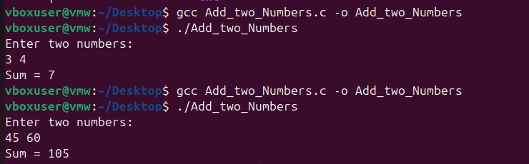
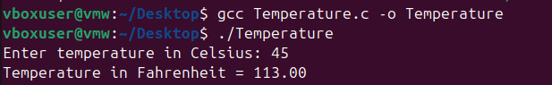

# Lab-01

## Question-01

### Write a C program to print “ Hello World”

## Output

## Question-02

### Write a C Program to print the address in multiple lines using only one printf.

## Output

## Question-03

### Write a C program to add two numbers, take number from user.

## output

## Question-04

### WAP a C program to calculate the area and perimeter of a rectangle based on its length and width.

## Output

## Question-05

### WAP a C program to Convert temperature from Celsius to Fahrenheit using the formula: F = (C * 9/5) + 32.

## Output

