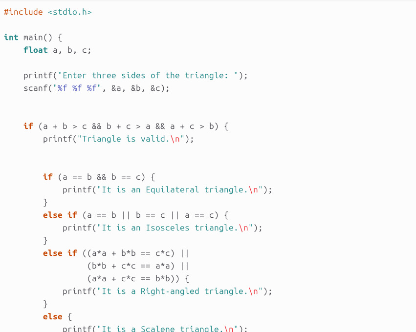
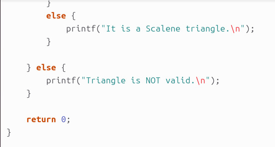
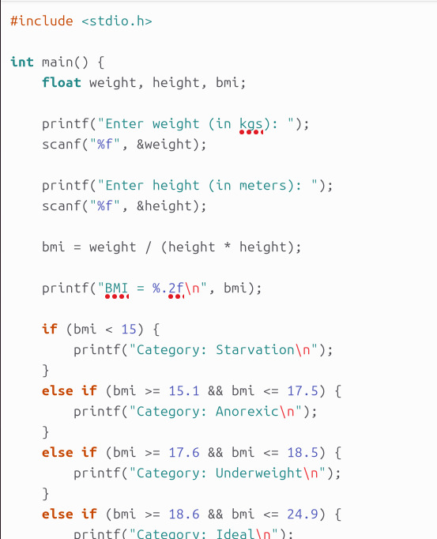
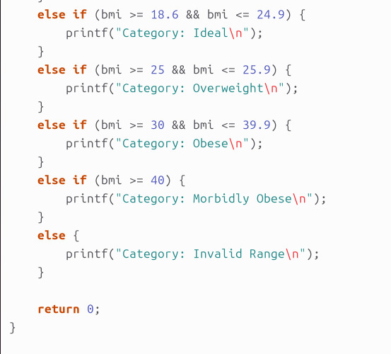
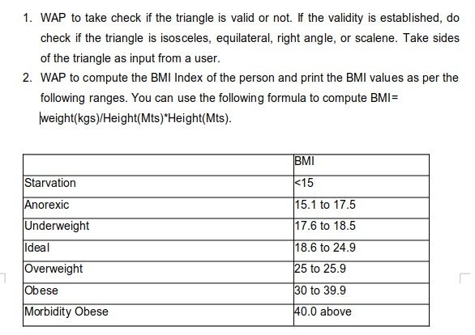

# Lab-02

## Question-01 and 02

## Question 01

## Question 02 

## Output 01 and 02

## Question-03(a) and 3(b)

## Question 3(a)

## Question 3(b)

## Output 3(a) and (b)

## Question-04 

The population of a town is 100000. The population has increased steadily at the rate of 10% per year for the last 10 years. Write a program to determine the population at the end of each year in the last decade.

## Output 04

## Question-05

Ramanujan Number is the smallest number that can be expressed as the sum of two cubes in two different ways. WAP to print all such numbers up to a reasonable limit.
            Example of Ramanujan number: 1729
           12^3 + 1^3 and 10^3 + 9^3. for a number L=20(that is limit)

## Output 05

